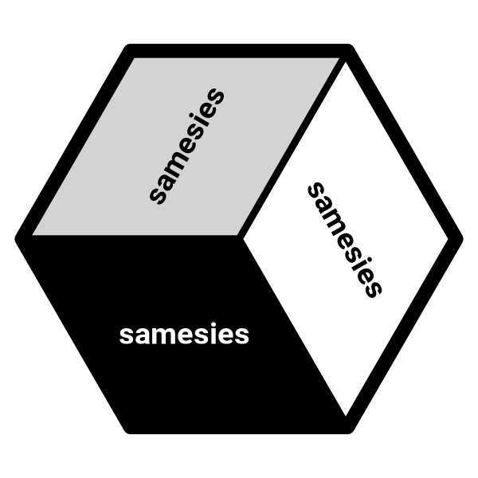

# samesies 

Samesies is a reliability tool for comparing the similarity of texts, factors, or numbers across two or more lists. The motivating use case is to evaluate the reliability of Large Language Model (LLM) responses across models, providers, or prompts.

## Installation

``` r
devtools::install_github("dylanpieper/samesies")
```

## Interface

Samesies provides three main functions for similarity analysis:

### `same_text()`

Compare similarity between multiple lists of character strings.

``` r
r1 <- list("R is a statistical computing software", 
           "R enables grammar of graphics using ggplot2", 
           "R supports advanced statistical models")
r2 <- list("R is a full-stack programming language",
           "R enables advanced data visualizations", 
           "R supports machine learning algorithms")

tex <- same_text(r1, r2)
```

Methods available via [stringdist](https://github.com/markvanderloo/stringdist) (e.g., `method = "osa"`):

-   Transformational Algorithms

    -   **osa**: Adjacent transposition edits
    -   **lv**: Basic edit distance
    -   **dl**: Comprehensive edit distance with transpositions

-   Structural Comparison

    -   **hamming**: Position-wise character differences
    -   **lcs**: Longest shared subsequence
    -   **qgram**: Subsequence matching
    -   **cosine**: Vector-space string similarity
    -   **jaccard**: Set-based string comparison

-   Linguistic Matching

    -   **jw**: Prefix-weighted string matching
    -   **soundex**: Phonetic encoding

### `same_factor()`

Compare similarity between multiple lists of categorical data.

``` r
cats1 <- list("R", "R", "Python")
cats2 <- list("R", "Python", "R")

fct <- same_factor(cats1, cats2, 
                   levels = c("R", "Python"))
```

Methods available (e.g., `method = "exact"`):

-   **exact**: Exact matching
-   **order**: Distances across ordered factor levels

### `same_number()`

Compare similarity between multiple lists of numeric values.

``` r
n1 <- list(1, 2, 3)
n2 <- list(1, 2.1, 3.2)

num <- same_number(n1, n2)
```

Methods available (e.g., `method = "exact"`):

-   **exact**: Exact matching
-   **percent_diff**: Percentage difference
-   **normalized**: Normalized difference (set `max_diff` or else auto-calculate)

``` r
num <- same_number(n1, n2, 
                   method = "normalized", 
                   max_diff = 2)
```

-   **fuzzy**: Fuzzy matching with tolerance (set `epsilon` or else auto-calculate)

``` r
num <- same_number(n1, n2, 
                   method = "fuzzy", 
                   epsilon = 0.1)
```

## Nested Lists

Nested lists are supported as long as they share the same names and lengths.

## Methods

All three functions return `similar` objects that support the following methods:

-   `print()`
-   `summary()`
-   `average_similarity()`
-   `pair_averages()`

## Credits

The hex logo image is fan art created by the Reddit user [WistlerR15](https://www.reddit.com/r/Spiderman/comments/k3pcj3/remade_the_spiderman_meme_with_my_favorite/).
