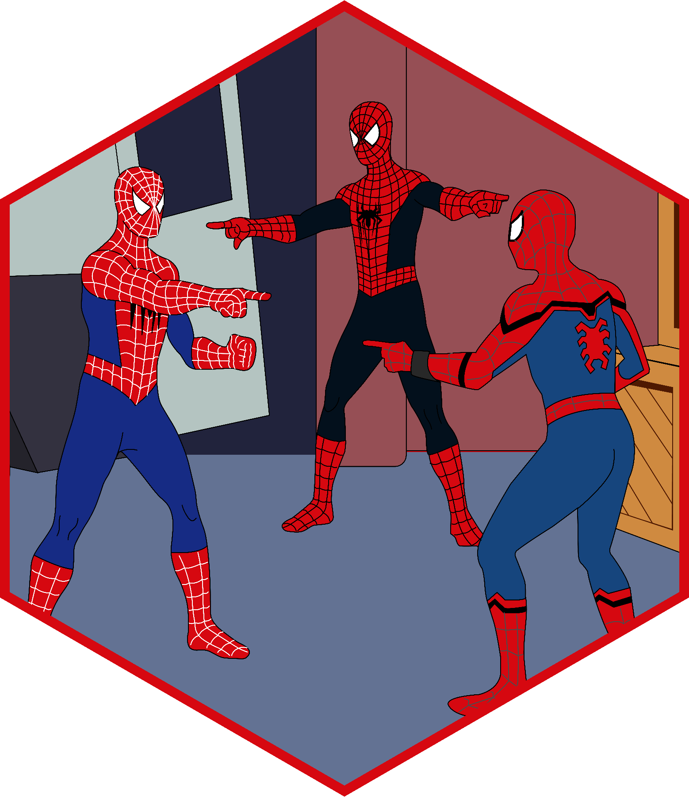

# samesies 

[](https://cran.r-pkg.org/package=samesies) [](https://github.com/dylanpieper/samesies/actions/workflows/R-CMD-check.yaml)

Compare lists of texts, factors, or numerical values to measure their similarity. Use cases include comparing responses from multiple raters, evaluating model outputs, and assessing data consistency.

## Installation

From CRAN:

``` r
# install.packages("pak")
pak::pak("samesies")
```

Development version:

``` r
pak::pak("dylanpieper/samesies")
```

## Basic Usage

samesies provides three main functions for measuring similarity:

### [same_text()](https://dylanpieper.github.io/samesies/reference/same_text.html)

Compare similarity between multiple lists of character strings:

``` r
library(samesies)

r1 <- list("R is a statistical computing software", 
           "R enables grammar of graphics using ggplot2", 
           "R supports advanced statistical models")
r2 <- list("R is a full-stack programming language",
           "R enables advanced data visualizations", 
           "R supports machine learning algorithms")

tex <- same_text(r1, r2)
#> ✔ Computed osa scores for "r1_r2" [mean: 0.43]
#> ✔ Computed lv scores for "r1_r2" [mean: 0.43]
#> ✔ Computed dl scores for "r1_r2" [mean: 0.43]
#> ✔ Computed hamming scores for "r1_r2" [mean: 0.123]
#> ✔ Computed lcs scores for "r1_r2" [mean: 0.061]
#> ✔ Computed qgram scores for "r1_r2" [mean: 0.682]
#> ✔ Computed cosine scores for "r1_r2" [mean: 0.771]
#> ✔ Computed jaccard scores for "r1_r2" [mean: 0.735]
#> ✔ Computed jw scores for "r1_r2" [mean: 0.818]
#> ✔ Computed soundex scores for "r1_r2" [mean: 0.667]
```

Methods available via [stringdist](https://github.com/markvanderloo/stringdist) (e.g., `method = "osa"`):

-   **Edit Distance Methods**
    -   osa, lv, dl
-   **Token-Based Similarity**
    -   hamming, lcs, qgram, cosine, jaccard
-   **Phonetic Methods**
    -   jw, soundex

### [same_factor()](https://dylanpieper.github.io/samesies/reference/same_factor.html)

Compare similarity between multiple lists of categorical data:

``` r
f1 <- list("R", "R", "Python")
f2 <- list("R", "Python", "R")

fct <- same_factor(f1, f2)
#> ℹ Skipping 'order' method as factor levels are not ordered
#> ✔ Computed exact scores for "f1_f2" [mean: 0.333]
```

Compare similarity based on ordered factors:

``` r
of1 <- list("High School", "Bachelor's", "Master's", "PhD")
of2 <- list("Bachelor's", "High School", "PhD", "Master's")

edu_comparison <- same_factor(of1, of2, 
                              levels = c("High School", "Bachelor's", "Master's", "PhD"))

fct_ordered <- average_similarity(edu_comparison)
#> ✔ Computed exact scores for "of1_of2" [mean: 0]
#> ✔ Computed order scores for "of1_of2" [mean: 0.667]
```

Methods available (e.g., `method = "exact"`):

-   **exact**: Exact matching
-   **order**: Distances across ordered factor levels

### [same_number()](https://dylanpieper.github.io/samesies/reference/same_number.html)

Compare similarity between multiple lists of numeric values:

``` r
n1 <- list(1, 2, 3)
n2 <- list(1, 2.1, 3.2)

num <- same_number(n1, n2)
#> ✔ Computed exact scores for "n1_n2" [mean: 0.333]
#> ✔ Computed raw scores for "n1_n2" [mean: 0.1]
#> ✔ Computed exp scores for "n1_n2" [mean: 0.908]
#> ✔ Computed percent scores for "n1_n2" [mean: 0.963]
#> ✔ Computed normalized scores for "n1_n2" [mean: 0.955]
#> ✔ Computed fuzzy scores for "n1_n2" [mean: 0.977]
```

Methods available (e.g., `method = "exact"`):

-   **exact**: Exact matching
-   **raw**: Absolute difference
-   **exp**: Exponential decay on the absolute difference
-   **pct_diff**: Percentage difference
-   **normalized**: Normalized difference
-   **fuzzy**: Intelligent threshold-based matching that adapts to data scale:
    -   Uses two tolerance thresholds: absolute (calculated) and relative (default 2%)
    -   Calculation of the absolute threshold averages data variability (10% of standard deviation), magnitude (0.5% of mean absolute values), and range (1% of value range)
    -   Effective threshold is the larger of these two values
    -   Perfect matches (score = 1.0) when difference ≤ effective threshold
    -   Scores decrease smoothly as differences exceed the threshold

## List Support

### Named Lists

For more control over results, you can use named lists to specify custom labels for comparisons:

``` r
result_number <- same_number("baseline" = n1, "treatment" = n2, method = "fuzzy")
#> ✔ Computed fuzzy scores for "baseline_treatment" [mean: 0.978]
```

### More Lists

When you input more than two lists, samesies computes pairwise comparisons across all lists:

``` r
r1 <- list("Statistical computing", "Data visualization", "Machine learning")
r2 <- list("Statistical software", "Data plotting", "ML algorithms") 
r3 <- list("Statistical analysis", "Data graphics", "AI models")

multi_text <- same_text(r1, r2, r3, method = "cosine")
#> ✔ Computed cosine scores for "r1_r2" [mean: 0.717]
#> ✔ Computed cosine scores for "r1_r3" [mean: 0.607]
#> ✔ Computed cosine scores for "r2_r3" [mean: 0.68]
```

### Nested Lists

Compare nested lists with identical structure and names:

``` r
nest1 <- list(
  group_a = list("Good", "Very Good", "Fair"),
  group_b = list("Excellent", "Good", "Poor")
)

nest2 <- list(
  group_a = list("Very Good", "Good", "Fair"), 
  group_b = list("Good", "Excellent", "Fair")  
)

nested_result <- same_text(nest1, nest2, method = "jw")
#> ✔ Computed jw scores for "nest1_nest2" [mean: 0.25]
```

## Methods

All three functions return `similar` objects that support the following methods:

``` r
result <- same_text(r1, r2, method = "cosine")

# Print detailed results
print(result)

# Summarize results  
summary(result)
#>  method  pair avg_score
#>  cosine r1_r2     0.771

# Get average similarity scores
average_similarity(result)
#> cosine 
#>  0.771

# Get pair-wise averages
pair_averages(result)  
#>   method  pair avg_score
#> 1 cosine r1_r2     0.771
```

## Accessing Object Data

The package uses S3 objects, allowing access to the underlying data using `$`:

``` r
result <- same_text(r1, r2, method = "cosine")

# Access similarity scores
result$scores
#> $cosine
#> $cosine$r1_r2
#>       R is a statistical computing software 
#>                                   0.7917448 
#> R enables grammar of graphics using ggplot2 
#>                                   0.7027498 
#>      R supports advanced statistical models 
#>                                   0.8197365

# Access methods used  
result$methods
#> [1] "cosine"

# Access list names
result$list_names  
#> [1] "r1" "r2"
```

Available components:

-   `scores`: A list of similarity scores for each method and comparison pair
-   `summary`: A list of statistical summaries for each method and comparison pair
-   `methods`: The similarity methods used in the analysis
-   `list_names`: Names of the input lists
-   `raw_values`: The original input values
-   `digits`: Number of decimal places for rounding results in output

## Credits

The Spiderman image in the hex logo is fan art created by the Reddit user [WistlerR15](https://www.reddit.com/r/Spiderman/comments/k3pcj3/remade_the_spiderman_meme_with_my_favorite/).
